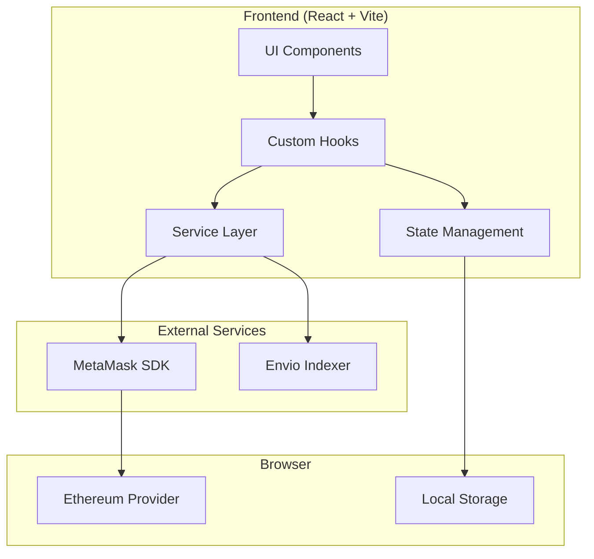
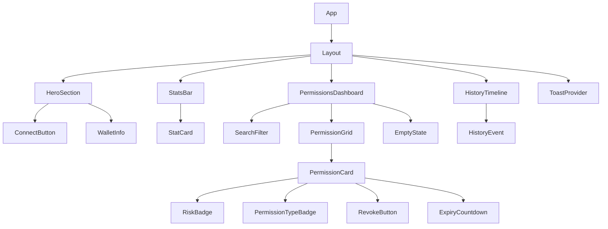
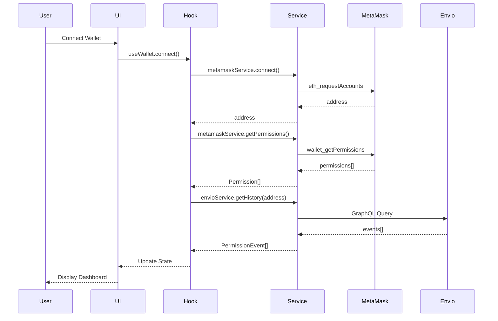

# Design Document

## Overview

The MetaMask Advanced Permissions Dashboard is a React-based single-page application built with Vite, providing users comprehensive visibility and control over their MetaMask wallet permissions. The application features a modern Web3 aesthetic with dark mode, glassmorphism design, and smooth Framer Motion animations.

The system integrates with MetaMask SDK for wallet connectivity and permission management, and uses Envio's GraphQL API for indexing permission event history. The UI is built with TailwindCSS and shadcn/ui components for a polished, professional appearance.

## Architecture



### Layer Architecture

1. **UI Layer**: React components using shadcn/ui, TailwindCSS, and Framer Motion
2. **Hook Layer**: Custom React hooks for wallet connection, permissions, and history
3. **Service Layer**: Abstraction over MetaMask SDK and Envio API calls
4. **State Layer**: React Context for global state (wallet, permissions, UI state)

## Components and Interfaces

### Component Hierarchy



### Core Interfaces

```typescript
// Wallet Types
interface WalletState {
  address: string | null;
  isConnected: boolean;
  isConnecting: boolean;
  chainId: number | null;
}

// Permission Types
interface Permission {
  id: string;
  dAppName: string;
  dAppUrl: string;
  dAppIcon: string | null;
  permissionType: PermissionType;
  accessLevel: AccessLevel;
  spendLimit: SpendLimit | null;
  grantedAt: Date;
  expiresAt: Date | null;
  riskLevel: RiskLevel;
}

type PermissionType = 'read' | 'write' | 'spend';
type AccessLevel = 'readonly' | 'write' | 'unlimited';
type RiskLevel = 'safe' | 'moderate' | 'dangerous';

interface SpendLimit {
  amount: string;
  token: string;
  tokenAddress: string;
}

// History Types
interface PermissionEvent {
  id: string;
  eventType: 'grant' | 'revoke';
  dAppName: string;
  dAppUrl: string;
  permissionType: PermissionType;
  timestamp: Date;
  transactionHash: string;
}

// UI State Types
interface FilterState {
  searchQuery: string;
  riskLevel: RiskLevel | null;
  permissionType: PermissionType | null;
}

interface UIState {
  isLoading: boolean;
  selectedPermissions: Set<string>;
  filters: FilterState;
}

// Stats Types
interface DashboardStats {
  totalPermissions: number;
  safeCount: number;
  moderateCount: number;
  dangerousCount: number;
  recentActivityCount: number;
  overallRiskScore: number; // 0-100
}
```

### Service Interfaces

```typescript
// MetaMask Service
interface IMetaMaskService {
  connect(): Promise<string>;
  disconnect(): Promise<void>;
  getPermissions(): Promise<Permission[]>;
  revokePermission(permissionId: string): Promise<void>;
  revokePermissions(permissionIds: string[]): Promise<void>;
  onAccountChange(callback: (address: string | null) => void): void;
  onChainChange(callback: (chainId: number) => void): void;
}

// Envio Service
interface IEnvioService {
  getPermissionHistory(address: string): Promise<PermissionEvent[]>;
  subscribeToEvents(address: string, callback: (event: PermissionEvent) => void): () => void;
}

// Toast Service
interface IToastService {
  success(message: string): void;
  error(message: string): void;
  warning(message: string): void;
  loading(message: string): string;
  dismiss(toastId: string): void;
}
```

### Component Props Interfaces

```typescript
interface PermissionCardProps {
  permission: Permission;
  isSelected: boolean;
  isRevoking: boolean;
  onSelect: (id: string) => void;
  onRevoke: (id: string) => void;
}

interface SearchFilterProps {
  filters: FilterState;
  onFilterChange: (filters: FilterState) => void;
  onClearFilters: () => void;
}

interface StatsBarProps {
  stats: DashboardStats;
  isLoading: boolean;
}

interface RiskBadgeProps {
  level: RiskLevel;
  size?: 'sm' | 'md' | 'lg';
}

interface ExpiryCountdownProps {
  expiresAt: Date;
  onExpired?: () => void;
}
```

## Data Models

### Permission Data Flow



### Risk Level Calculation

```typescript
function calculateRiskLevel(permission: Permission): RiskLevel {
  if (permission.accessLevel === 'readonly') {
    return 'safe';
  }
  
  if (permission.accessLevel === 'unlimited') {
    return 'dangerous';
  }
  
  if (permission.accessLevel === 'write') {
    if (permission.spendLimit === null) {
      return 'moderate';
    }
    // Has spend limit - check amount
    const limitValue = parseFloat(permission.spendLimit.amount);
    if (limitValue > 1000) {
      return 'dangerous';
    }
    return 'moderate';
  }
  
  return 'moderate';
}
```

### Overall Risk Score Calculation

```typescript
function calculateOverallRiskScore(permissions: Permission[]): number {
  if (permissions.length === 0) return 0;
  
  const weights = { safe: 0, moderate: 50, dangerous: 100 };
  const totalWeight = permissions.reduce(
    (sum, p) => sum + weights[p.riskLevel],
    0
  );
  
  return Math.round(totalWeight / permissions.length);
}
```

### Local Storage Schema

```typescript
interface StoredState {
  lastConnectedAddress: string | null;
  dismissedWarnings: string[];
  filterPreferences: FilterState;
}
```

## Correctness Properties

*A property is a characteristic or behavior that should hold true across all valid executions of a system-essentially, a formal statement about what the system should do. Properties serve as the bridge between human-readable specifications and machine-verifiable correctness guarantees.*

### Property 1: Wallet Connection State Consistency
*For any* wallet connection attempt, the wallet state SHALL transition from disconnected to either connected (with valid address) or remain disconnected (with error), never to an inconsistent intermediate state after the operation completes.
**Validates: Requirements 1.2, 1.3, 1.4**

### Property 2: Permission Display Completeness
*For any* set of permissions returned from MetaMask SDK, all permissions SHALL be rendered as Permission_Cards in the UI with no omissions or duplications.
**Validates: Requirements 2.1, 2.3**

### Property 3: Risk Level Determinism
*For any* permission with a given accessLevel and spendLimit, the calculated RiskLevel SHALL always be the same value (readonly→safe, unlimited→dangerous, write without limit→moderate).
**Validates: Requirements 3.1, 3.2, 3.3, 3.4**

### Property 4: Revocation State Integrity
*For any* successful permission revocation, the permission SHALL be removed from the displayed list and SHALL NOT reappear until explicitly re-granted.
**Validates: Requirements 4.3, 4.4**

### Property 5: Filter Result Correctness
*For any* applied filter (search query, risk level, or permission type), all displayed Permission_Cards SHALL match the filter criteria, and no matching permissions SHALL be hidden.
**Validates: Requirements 6.2, 6.3, 6.4**

### Property 6: Stats Calculation Accuracy
*For any* set of permissions, the total count in StatsBar SHALL equal the sum of safe, moderate, and dangerous counts, and SHALL equal the number of Permission_Cards displayed (before filtering).
**Validates: Requirements 7.1, 7.2**

### Property 7: Search Filter Idempotence
*For any* search query, applying the same filter twice in succession SHALL produce identical results.
**Validates: Requirements 6.2**

### Property 8: Bulk Selection Consistency
*For any* bulk revocation operation, the number of permissions revoked SHALL equal the number of permissions selected, and all selected permissions SHALL be processed.
**Validates: Requirements 4.5**

## Error Handling

### Error Categories

| Category | Handling Strategy | User Feedback |
|----------|------------------|---------------|
| MetaMask Not Installed | Detect via window.ethereum, show install prompt | Modal with install link |
| Connection Rejected | Catch rejection, reset state | Toast with retry option |
| Network Error | Retry with exponential backoff | Toast with retry button |
| Revocation Failed | Restore card state, log error | Error toast with details |
| Envio Query Failed | Graceful degradation, show warning | Warning banner, continue |
| Rate Limited | Queue requests, show waiting | Loading indicator |
| Wallet Locked | Prompt unlock | Toast with instructions |

### Error Boundary Strategy

```typescript
// Top-level error boundary for unexpected errors
class DashboardErrorBoundary extends React.Component {
  state = { hasError: false, error: null };
  
  static getDerivedStateFromError(error) {
    return { hasError: true, error };
  }
  
  render() {
    if (this.state.hasError) {
      return <ErrorFallback error={this.state.error} onRetry={this.reset} />;
    }
    return this.props.children;
  }
}
```

### Toast Notification Types

```typescript
type ToastType = 'success' | 'error' | 'warning' | 'loading';

interface ToastConfig {
  type: ToastType;
  message: string;
  duration?: number; // ms, undefined for persistent
  action?: {
    label: string;
    onClick: () => void;
  };
}
```

## Testing Strategy

### Dual Testing Approach

The application uses both unit tests and property-based tests to ensure comprehensive coverage:

- **Unit Tests**: Verify specific examples, edge cases, and integration points
- **Property-Based Tests**: Verify universal properties that should hold across all inputs

### Testing Framework

- **Unit Testing**: Vitest with React Testing Library
- **Property-Based Testing**: fast-check library
- **E2E Testing**: Playwright (optional)

### Unit Test Coverage

1. **Component Tests**
   - PermissionCard renders all permission data correctly
   - RiskBadge displays correct color for each risk level
   - SearchFilter updates filter state on input
   - EmptyState displays when no permissions exist
   - StatsBar shows correct counts

2. **Hook Tests**
   - useWallet handles connection lifecycle
   - usePermissions fetches and caches permissions
   - useFilters applies filters correctly

3. **Service Tests**
   - MetaMaskService handles SDK responses
   - EnvioService parses GraphQL responses
   - Risk calculation returns expected values

### Property-Based Test Coverage

Each property-based test MUST:
- Run a minimum of 100 iterations
- Be tagged with format: `**Feature: metamask-permissions-dashboard, Property {number}: {property_text}**`
- Reference the correctness property from the design document

1. **Property 1**: Wallet state transitions are valid
2. **Property 2**: All permissions are displayed without duplicates
3. **Property 3**: Risk level calculation is deterministic
4. **Property 4**: Revocation removes permissions correctly
5. **Property 5**: Filters return only matching results
6. **Property 6**: Stats sum equals total count
7. **Property 7**: Filter application is idempotent
8. **Property 8**: Bulk operations process all selected items

### Test File Structure

```
src/
├── components/
│   ├── PermissionCard/
│   │   ├── PermissionCard.tsx
│   │   └── PermissionCard.test.tsx
│   └── ...
├── hooks/
│   ├── useWallet.ts
│   └── useWallet.test.ts
├── services/
│   ├── metamask.service.ts
│   └── metamask.service.test.ts
├── utils/
│   ├── risk.ts
│   └── risk.test.ts
└── __tests__/
    └── properties/
        ├── risk.property.test.ts
        ├── filter.property.test.ts
        └── stats.property.test.ts
```
